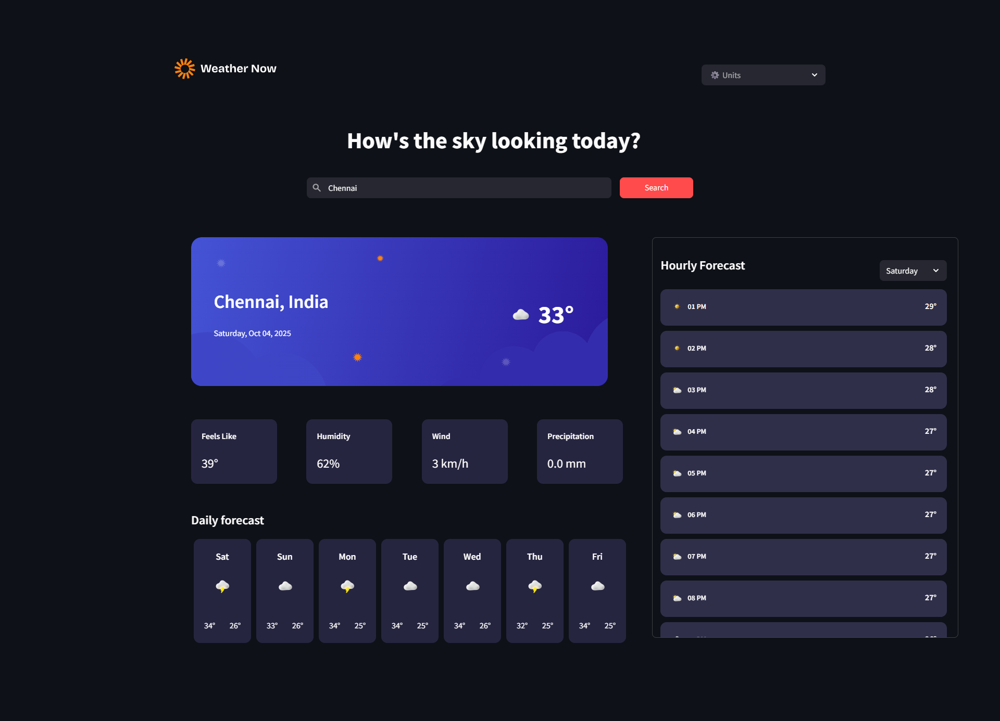

# Frontend Mentor - Weather app solution

This is a solution to the Weather app challenge on Frontend Mentor. Frontend Mentor challenges help you improve your coding skills by building realistic projects.

## Overview

### The challenge

Users should be able to:

- Search for weather information by entering a location in the search bar
- View current weather conditions including temperature, weather icon, and location details
- See additional weather metrics like "feels like" temperature, humidity percentage, wind speed, and precipitation amounts
- Browse a 7-day weather forecast with daily high/low temperatures and weather icons
- View an hourly forecast showing temperature changes throughout the day
- Switch between different days of the week using the day selector in the hourly forecast section
- Toggle between Imperial and Metric measurement units via the units dropdown 
- Switch between specific temperature units (Celsius and Fahrenheit) and measurement units for wind speed (km/h and mph) and precipitation (millimeters) via the units dropdown
- View the optimal layout for the interface depending on their device's screen size
- See hover and focus states for all interactive elements on the page

### Screenshot

### Links

- Solution URL: [Solution](https://github.com/Arvindh99/Weather-App-Hackathon/tree/main)
- Live Site URL: [Live App](https://weather-app-challenge.streamlit.app/)

## My process

### Built with

- Python – Core language for logic and API requests
- Streamlit – Framework for building the interactive weather dashboard
- streamlit-extras – For additional UI enhancements (like containers, spacing, etc.)
- HTML and CSS Custom Components
- Open-Meteo API – Free weather API used for real-time and forecast data

### What I learned

Building this project helped me strengthen both Python and Streamlit skills. Some key takeaways:

- API Integration – Fetching real-time, daily, and hourly forecasts from Open-Meteo
- Dynamic UI in Streamlit – Using st.columns, st.container, and custom HTML/CSS inside st.markdown
- Custom Weather Icons – Mapping Open-Meteo weather codes to icons and displaying them dynamically
- Unit Conversion – Switching between Metric (°C) and Imperial (°F) using a helper function
- Date & Time Formatting – Converting ISO date strings into friendly formats like Sat, Oct 5 and 3 AM
- Reusable Components – Structuring code for current weather, daily forecast, and hourly forecast separately

## Author

- Website - [Portfolio](https://arvindh-portfolio.lovable.app/)
- Frontend Mentor - [Arvindh](https://www.frontendmentor.io/profile/Arvindh99)

